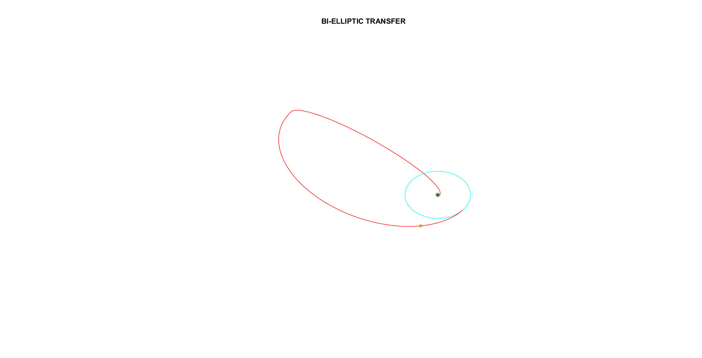
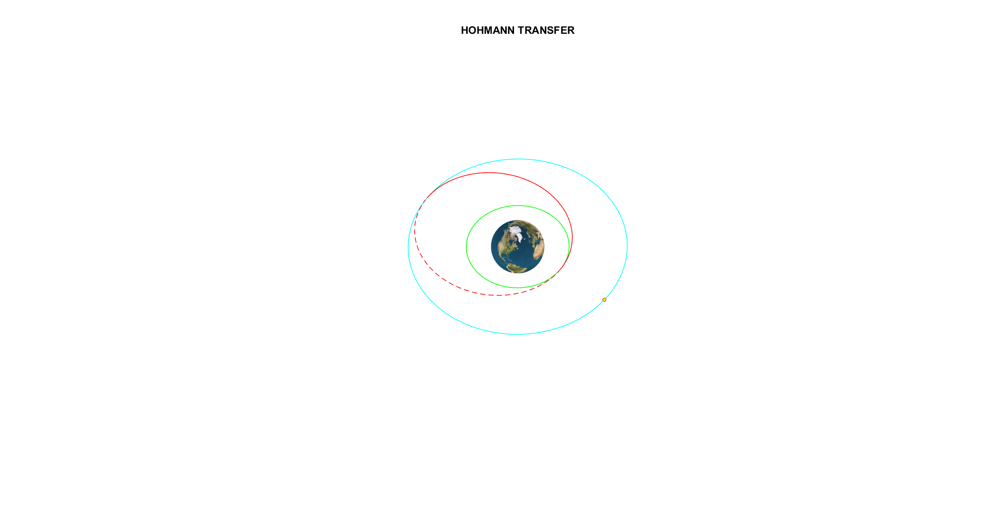

# Orbital-Transfer-Calculator-MATLAB
Computational tool designed to simulate and analyze orbital transfer maneuvers using classical astrodynamics/orbital mechanics. This project supports three fundamental transfer methods—Hohmann, Bi-Elliptical, and One-Tangent Transfers—providing accurate delta-V computations, trajectory planning, and clear 3D orbital visualizations.

I developed this tool primarily for academic use, research support, and aerospace education. The tool calculate all possible parameters and evaluates transfer efficiencies between circular or elliptical orbits with visual output to enable better understanding of transfer arcs, intermediate orbits, and burn locations.

## User-Manual
Just open the main.m in any MATLAB version no lower than R2021a.

## 🚀 Features
- Accurate delta-V computation
- Visual orbit plotting in 3D
- Supports user-defined initial and target orbits
- Compliant with classical orbital mechanics
- Manual input of inclination
- Calculation of Eccentricity
- Transfer time

## 📈 Sample Simulation
- ### Bi-Elliptical Transfer

- ### Hohmman Transfer

- ### One Tangent Transfer

## Read the paper:
[Modular Orbital Mechanics Toolkit for Transfer Strategy Evaluation in Earth-Centric Orbits](https://www.researchgate.net/publication/392228466_Modular_Orbital_Mechanics_Toolkit_for_Transfer_Strategy_Evaluation_in_Earth-Centric_Orbits_1st_Edition)

## 🛠 Requirements
- MATLAB R2021a or later
